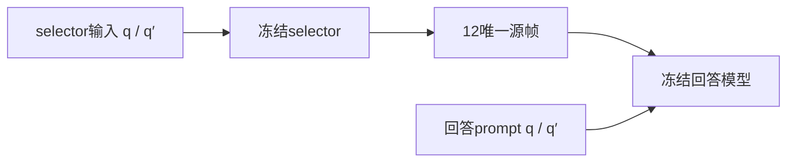

# VLM-BATCH-006｜新颖性与可识别性（任务1—3）

**结论：普通问题感知选帧不是新算法；路线2主效应最多为 CONDITIONAL_MEASUREMENT。H-S选择路径分离尚为 UNKNOWN，不据缺证据判新颖。** 本报告支持任务10对“新算法／当前真实执行”的 NO-GO，不宣布现象研究永久不可做。

范围：本子审查复用本轮父任务已实际取得并缓存的9个不同官方HTML页面（5个会议／摘要页、4个预印本全文HTML）。**整包实际9个官方HTML响应合计2,129,480 bytes；协议仅设12页上限，没有固定响应体bytes cap。子审查新增网络0不等于整包网络0**，余3页未使用。父任务另用少量web search定位arXiv编号，搜索结果不作正式方法证据，检索后端流量未单独计量。0 PDF、源码包、原研究目录、媒体、数据、旧答案、模型或实验。不修改任务书、旧toy或其他文件；以下控制均未执行。

## 任务1｜五个直接先例的方法／消融红队

证据级别：**方法+消融**仅指确实读到所列HTML版本；会议landing页不能冒充正式全文。未获取／未核实项目记 UNKNOWN，不以“未读到”证明前人没做。

| 直接先例与来源 | Query如何进入selector；预算 | 实读强对照；时间／统计单位 | 路径消融证据 |
|---|---|---|---|
| **Q-Frame**：[ICCV2025正式摘要](https://openaccess.thecvf.com/content/ICCV2025/html/Zhang_Q-Frame_Query-aware_Frame_Selection_and_Multi-Resolution_Adaptation_for_Video-LLMs_ICCV_2025_paper.html)；[方法HTML](https://arxiv.org/html/2506.22139)，页眉 **v3，2025-07-22** | 问题编码与候选帧内积，softmax／Gumbel后Top-K，并按相关性分配分辨率。默认128均匀候选→8输入帧，或约8高分辨率帧的多分辨率预算；不是本包12唯一源帧合同。 | Table4：Uniform／CLIP-topK／QFS × Fixed／MRA；Table2有同骨干Frame-Voyager。Table6实际均值tokens/video：8高分辨率2265.1，对4高+8中+32低2344.8（+3.5%），并非严格等token。LVB1337 QA，Video-MME2700 QA/900视频；真实PTS匹配与来源组CI未核得。 | **selector组件替换有**。Table4是sampling×resolution的3×2，非selector措辞×回答prompt 2×2；后两路径的措辞隔离未获得直接证据。 |
| **Self-Adaptive Sampling / MIF、MDF**：[NAACL2024正式摘要](https://aclanthology.org/2024.findings-naacl.162/)；[预印本方法HTML](https://arxiv.org/html/2307.04192)，**v4，2024-03-31** | 正式摘要确认MIF基于question–frame correlation及MDF／问题感知非必要性议题。**仅预印本细节**：MIF以问题与帧caption的分数top-N；MDF不用问题、用视觉帧相似度。MIF候选16均匀帧；CLIP/AIO3帧、GIT6帧；实际token UNKNOWN。 | 预印本§4.2：uniform／官方AIO、IGV、VCSR及帧数重设；Table1固定6帧比较captioner/grader；Fig6帧数、间隔／构造成功率。间隔W=L/(λN)基于帧索引，不是PTS合同；按问题accuracy，视频／QA数分别列出，来源组CI未核得。 | 预印本有策略／容量／帧数消融；selector措辞隔离、跨题S_shuf、prompt-only、完整2×2未读到。**正式全文全部细节仍UNKNOWN。** |
| **DIG**：[CVPR2026正式摘要](https://openaccess.thecvf.com/content/CVPR2026/html/Li_Divide_then_Ground_Adapting_Frame_Selection_to_Query_Types_for_CVPR_2026_paper.html)；[方法HTML](https://arxiv.org/html/2512.04000)，**v2，2026-03-24** | LLM按问题分global/localized：global用uniform，localized用CAFS／帧奖励／区间细化；奖励输入含问题及duration/timestamp。2fps候选；主实验8–256帧、每帧56 tokens、索引窗口wlen=2。 | Fig5直接比较query type×uniform/pipeline；Fig7以uniform替CAFS；Table2换CLIPScore／7B／32B奖励。覆盖对照匹配平均帧数；不同方法候选为1fps／128帧／2fps，非完全匹配。主指标QA accuracy；Fig9为TFLOPs/QA，附录时间按数据集分钟，不能换成本机单题wall；实际PTS、来源组CI UNKNOWN。 | selector组件与奖励模型替换有。问题类型分层不等于问题置换；措辞selector-only、prompt-only、完整2×2未获得直接证据。 |
| **Efficient Frame Selection via RL**：[CVPR2026正式摘要](https://openaccess.thecvf.com/content/CVPR2026/html/Qin_Efficient_Frame_Selection_for_Long_Video_Understanding_via_Reinforcement_Learning_CVPR_2026_paper.html)，pp.16944–16953 | 摘要明确预训练学习frame–query relevance；RL以帧层及组合层奖励学习任务收益，不只最大化单帧相关性。**具体推理query接口、frame/token预算 UNKNOWN。** | **仅摘要**；强controls、奖励公式、时间／样本单位 UNKNOWN。摘要的uniform动机不算已核实实验对照。 | **RL_FULL_METHOD=UNKNOWN**；三种路径设计均UNKNOWN；不以第三方补全文。 |
| **VideoQA Empirical Study**：[全文HTML](https://arxiv.org/html/2408.04223v2)、[摘要／版本页](https://arxiv.org/abs/2408.04223)，2024首发、**v2，2025-06-14** | 行为审计，不是统一query-selector。GPT-4o路径为3fps解码后uniform32帧；PosVQA可能少于32；不同模型帧／token不能当相同。 | Normal／Blind／Pos／Neg／GroundedQA；时间成对probe、答案捷径、帧／词顺序／删词／改写。shuffle做3随机种子；accuracy及prediction flip按QA汇总，未核得来源组CI。 | **prompt-only影响已有直接证据**：§3.5只要求GPT-4o输出grounding帧索引，NormalVQA从49.0到64.7；并非本包完整2×2。问题内shuffle／rephrase不是跨题selector S_shuf。 |

### 证据定位与版本限界

- **Q-Frame**：§3.2–3.4；§4.1；§4.3 Tables4–6；B.4 Tables12、14。后者将embedding与sampling延迟分开，计时样本分母未核；其机器是8 H100，不能直接外推本机。会议摘要与预印本题名对应，但未比对accepted PDF等价性。
- **MIF/MDF**：预印本§3.2–3.4、§4.2–4.4、§5.1/5.3 Fig6、附录D/E/F。正式题名是 **Accurate**，预印本是 **Efficient**；正式摘要只能确认概念，不能把全部预印本预算／表号强归正式最终版。§3.4文字local minima与Algorithm1 argmax有矛盾，具体S_d不可据此当无歧义可执行合同。
- **DIG**：§3、§4.1–4.4、§5.1、§6.1–6.5 Figs5–9/Table2、附录A Table3/F.1/G.1。wlen是索引窗口，不是固定秒宽；奖励prompt有秒值不证明来自真实PTS。
- **RL**：正式Abstract，证据仅至两阶段／组合收益主张；不核验PDF、supp或代码。
- **Empirical v2**：§3.3–3.7 Figs2–13；附录.3/.4、Tables7/8。改写经GPT生成并人工检查／修正，是其已做实验，不授权本包新增人工标签／API；arXiv comments称IJCV'25，未核期刊最终全文等价性。

这些先例足以否决“首次query-aware”“首次question-agnostic对照”“首次发现语言／提示敏感”“首次不只追求relevance”等宽泛主张；不能据本次有限HTML阅读判同一精确因子试验在所有文献不存在。

## 任务2｜S_q、S_t、S_d、S_shuf与可选2×2的边界

| 差异点 | 已覆盖／本轮未知 | 裁定及一票否决 |
|---|---|---|
| **S_q vs S_t** | Q-Frame固定分辨率sampling对照、MIF/MDF、DIG类型分层均已直接研究。SigLIP／Qwen／12帧／新数据本身只换实现或总体。 | 新算法 **REPLICATION_ONLY**；严控来源／成本的配对总体效应可为 **CONDITIONAL_MEASUREMENT**。若卖点仅query优于uniform，直接否决新颖性。 |
| **S_d** | question-agnostic视觉内容／间隔选择已有MDF；Q-Frame随机化／多样性、DIG覆盖控制亦相关。具体冻结算法与PTS、公平预算尚未知。 | 原理 **REPLICATION_ONLY**；具体测量有条件。若差异只是改核、改权重／名称、复现既有多样性作用，一票否决。算法文本矛盾或实现未冻先UNKNOWN。 |
| **S_shuf** | 用不对应视频的替代问题选帧、回答仍问原q：本轮未取得完全相同设计；Empirical词内shuffle不是这个设计。 | **UNKNOWN / CONDITIONAL_MEASUREMENT**，不是新颖性PASS。若直接先例已实施该负对照，撤销该差异卖点；若donor来自保护源、带答案或按效果选题，停止。 |
| **selector-only同义扰动** | 需合法、事前有效等义q/q′，回答保持q；组件替换／问题类型分层不足以证明同设计。 | **UNKNOWN**。只有有效pair、独立接口、可审计成本同时成立，才谈可能不同测量；无pair则 **NOT FEASIBLE**，不自行造等义标签。 |
| **selector×prompt 2×2** | 本轮未取得同一完整因子试验。Q-Frame3×2、DIG类型×策略和Empirical提示变化均覆盖部分因素而非此交叉。 | 当前 **UNKNOWN**；只有正式方法对应、有效pair、独立接口／成本核查确实支持具体区别时，才可考虑 **POSSIBLE_DISTINCT_DESIGN**，仍非新算法。若先例已做同因子／估计量，立刻降为复现，不凭“新模型”救回。 |

路径分离是控制设计，不是新算法。有效q/q′下四个预定单元如下；主要S_q−S_t仍保持唯一主效应，不能事后在这些副比较中挑显著者。

| selector输入／回答prompt | q | q′ |
|---|---|---|
| q | A00=Y(S(q),q) | A01=Y(S(q),q′) |
| q′ | A10=Y(S(q′),q) | A11=Y(S(q′),q′) |

selector-only=A10−A00；prompt-only=A01−A00；交互=A11−A10−A01+A00。它们识别的是冻结路径干预的输出／正确率差，不是注意力、相似度或语义事实的因果机制。q′不等义则同一答案评分目标失效；S_shuf应独立视为不对应问题的负对照，不能充等义pair。

当前独立question接口、合法pair、真实PTS／token及source门不是本报告已验收事项；不能自动READY或释放QA预算。

## 任务3｜可识别性与强反解释（全部未执行）

若候选宇宙、每题各臂、下游prompt、模型等预先冻结，S_q−S_t可估计**特定策略的来源组总体效果**。它改变所选时间与内容，不能把效果归结为“问题相似度／视觉注意力”的单一因果机制；内容是策略作用路径的一部分，不宜事后以post-treatment匹配假装纯机制被识别。

| ≥6项竞争解释 | 可减少解释的预定、可测控制／收据 | 剩余限界／拒绝条件 |
|---|---|---|
| **bin内PTS漂移／最大间隔** | 相同候选与预定bin；逐臂记真实PTS、bin内位置、跨度／max-gap、clip偏移与唯一key。 | 同bin直方图不够；index/FPS不是PTS；缺字段UNKNOWN，不宣称时间已匹配。 |
| **内容／事件覆盖、多样性** | 冻结S_d及覆盖统计、帧重叠；DIG式类型分层作为预定辅助，不调结果。 | 无gold区间也不能判事实充分；不同内容不可完全锁定又保持选帧干预，只可弱化机制归因。 |
| **清晰度、resize／纵横比** | 同processor／像素规则，预注册画面质量及源尺寸统计。 | 相同帧数不保证同可辨性；质量变化可解释收益，未实测UNKNOWN。 |
| **实际patch/grid/token／额外容量** | 每臂实际输入tensor/grid/token、分辨率和生成上限，full wall／VRAM／IO／SigLIP费用。 | Q-Frame名义预算即有token差；无实际收据不能报等算力，不空跑补齐。 |
| **query type／语言捷径** | 只用既有合法类型或事前固定无答案parser；可预注册BlindQA／原q恒定及类型分层。 | DIG已有异质性、Empirical已有捷径；不凭任务名或旧正确率筛选题，不新增人工类型标签。 |
| **retriever／prompt偏置、文本截断** | 固定encoder与其实际token IDs／mask；S_shuf donor按来源独立及预定格式／语言规则取，固定回答q。 | donor的词频／类型仍非完全可交换；提示模板存在不等于prompt-only消融，新增臂需独立授权。 |
| **随机化、多样性或tie规则** | 预先种子／并列规则，保存选择trace、唯一帧及canonical输入；同一候选宇宙。 | Gumbel或MMR也改变分散性；未冻具体S_q不能声称测的是纯相似度。 |
| **问题改写改变语义／评分目标** | 仅使用合法预审等义pair；冻结原答案的隔离scorer和四单元。 | 无pair即H-S NOT FEASIBLE；不按后来正确性挑“有效改写”，不复制论文人工修正流程。 |
| **源重复／语言记忆／计分器** | 预定来源组汇总、排除旧探索／保护源；固定MC评分／解析及全失败分母。 | QA数不是独立video/source数；预训练熟悉度与语义独立不能仅由hash证明，LLM judge变化也可改变flip率。 |
| **调用顺序／缓存／实现差异** | 预定臂顺序、独立真实cost、每臂输入与planned→terminal账；核算法确为声明版本。 | 同名selector可能混合uniform／MMR；来源、输入或接口不符即停，而非追补失败源。 |

上述是未来可执行协议需要的控制，不是当前已测结果。若某因素无法分离，停止对应因果宣称而保留条件性总体效应问题；不设计结果驱动的追补、补样、第四算法或额外READY包。

**交给任务10：NG0“普通S_q/S_t新算法”=FAIL；H-S／完整路径因子试验区别=UNKNOWN；仅有条件性测量候选。** 合法数据、接口／PTS／真实成本和power仍须另外门报告，文献与toy不能把这些门变PASS，retain0／无期刊创新承诺。

